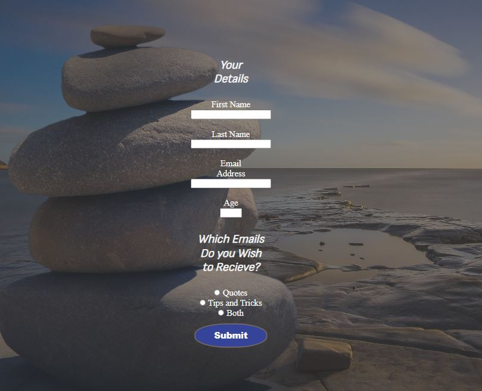

# Peace Of Mind

[Peace Of Mind](https://jamcevoy.github.io/Peace_of_Mind/index.html)

Peace of Mind is a meditation site that hopes to help people better understand the ins and outs of meditation and why it is a beneficial practice.

This site is for all types of people and will have different methods of meditation for every situation. Along with the option to be added to an email list, which would be sent out weekly with motivational quotes and little tips and tricks on getting the most out of meditation.

## User Needs

- I would want the website to be accessible from different devices (Phone, Laptop, PC, Tablet).
- It would need to be responsive to all screens, ensuring the information is readable and understandable.
- As a user, I would want to see relaxing and smooth colors, with great use of imagery to make the experience more realistic and easier to envision examples like People meditating in different environments, videos with people in the zone of meditation, and places in nature that enduce relaxing thoughts.

## Features

### Existing Features

- __Navigation Bar__

  - Featured on all four pages, the navigation bar includes links to the Home page, Benefits, techniques, and Sign Up page and is identical on each page to allow for easy navigation.
  - I went for a more simplistic view of the option of stacked for smaller screens, Showing the user option across all pages. But keeping the menu neat to the head of each page.
  - For larger screens like laptops and PCs, I set the nav menu out in a row evenly spaced with heavy font and larger font sizes. This utilizes the space of the screen but gives a better display for users who are visually impaired.
  - This section will allow the user to easily navigate from page to page across all devices without having to revert back to the previous page via the ‘back’ button.

- __In The Following Pages__

  - The landing includes a section that describes briefly the contents of each of the pages.
  - This section's purpose is to pique the interest of the user and encourage them to learn more and the other pages.
  - Using Flexbox, I made the photos and information sit next to each other on larger screens.
  - I put the photo in a circle to give the section a playful but organized look. For smaller screens, this image drops below the text section and goes back to square this is to make the page more linear on mobile and tablet devices.

- __Video Section__

  - This section shows the user some examples of meditation.
  - The Video showcases that meditation is not just a solo activity and can be done in company.
  - The video does not play the user hit play.

- __The Footer__

  - The footer section includes links to the relevant social media sites for Peace Of Mind. The links will open to a new tab to allow easy navigation for the user.
  - The footer is valuable to the user as it encourages them to keep connected via social media.
  - I did not have wed pages for the links so I set all links to login pages except for youtube, which just goes to the YouTube homepage.

- __Benefits of a Healthy Mind__

  - The Benefits of a Healthy Mind will provide the user with useful information on mental health.
  - This section is valuable to the user as they will be more invested through the list of benefits.
  - I left the bullet point on a larger screen so the information seems more organized and together.
  - On Smaller screens, the content gets rid of the bullet points and centers to make the most of screens like mobile phones and tablets

- __Factors That Can Influence Your Mental State__

  - The Factors That Can Influence Your Mental State section will provide the user with useful information on different factors that affect mental health.
  - This section is valuable to the user as they will learn more about some of the things we might not know contribute to a bad mental state, encouraging them to practice meditation more often.
  - I moved this information to the right side of the page to separate the information letting the user know it is different information.
  - With a smaller screen, the gap between the two divs closes to make the best of the space but the color still sets apart the information.

  

  - __Techniques__

  - The Techniques section will provide the user with different methods of meditation.
  - This is the important section as it points out and explains the different ways someone could meditate, no matter the location or situation.
  - Like the benefits page I used color and alignment to set apart the information, while on this page I split the rows opposite each row. I felt this would make the page more appealing encouraging people to read the information.
  - I Added icons to each type with symbols I believed closely represented the type of meditation, This will allow users who might not be the best readers to understand what each type consists of. Making the page fun but also a bit more accessible.

  
  
- __The Sign Up Page__

  - This page will allow the user to get signed up to Love Running to start their running journey with the community. The user will be able to specify if they would like to take part in road, trail, or both types of running. The user will be asked to submit their full name and email address.
  - When selected the submit button background goes black letting the user know they have selected it successfully.
  - I limited the ages field to a max of 99 and a minimum of 1, this will prevent any numbers over 3 digits from being submitted.

### Features Left to Implement

- Meditation audio section would be a feature I think my website would need to be complete. Unfortunately, with the layout, it looks like this would be a bigger task just to find a place to fit it. I would need to think more in-depth about where it fits in and why. Then apply the change to my code.

## Testing

- I tested that this page works in different browsers: Chrome, Firefox, Microsoft Edge, and Safari.

- I confirmed the site was responsive using the Chrome dev tools device toolbar.
- I can confirm that the nav and social links are reliable and easy to understand, Also the social links open in a new tab and open apps on mobile phones.
- I have confirmed the forms work, required entries in every field, the Radio button requires at least one to be selected, only accepts an email in the email field, and the submit button works.
- I have asked some family and friends to try the websites on a PC, laptop, and mobile phone (Andriod and iPhone).

### Validator Testing

- HTML
  - No errors were returned when passing through the official [W3C validator](https://validator.w3.org/nu/?doc=https%3A%2F%2Fcode-institute-org.github.io%2Flove-running-2.0%2Findex.html)
    
- CSS
  - No errors were found when passing through the official [(Jigsaw) validator](https://jigsaw.w3.org/css-validator/validator?uri=https%3A%2F%2Fvalidator.w3.org%2Fnu%2F%3Fdoc%3Dhttps%253A%252F%252Fcode-institute-org.github.io%252Flove-running-2.0%252Findex.html&profile=css3svg&usermedium=all&warning=1&vextwarning=&lang=en#css)
    

### Bugs I Faced Along The Way

- One of the biggest issues I faced was with the video, because of the quality of the original the page would stall, and sometimes the video wouldn't even load. I found a converter online that lowered the quality and size of the video, but not so much as to make the video blurry or unseeable.
- Another issue I had was with the image on the welcome page, Originally the picture sat on top of the video on the homepage. When the screen was pulled to a bigger screen the picture stretched and was noticeably distorted. I got the idea to put the picture into a circle on bigger screens and with the use of Flexbox I placed the picture next to the text letting the information breathe a little but also containing the picture size.
- The form was the most difficult challenge when in certain screen sizes the fields jumped all over the screen and the background image pulled up leaving the background color from the main body showing, Just made the page look messy. Using Media Queries and the dev tools in Chrome I isolated the sizes and required sizes needed to fit everything how I wanted.
- Another problem I had with the form was the background image made any color made the text hard to read. I fixed this by laying a transparent background over the image. Light enough to see the image behind but dark enough the see the text.
- I had trouble with the benefits and techniques page when it came to containing the information on the mobile screen on my phone (iPhone 11) the information was pushed below the footer and a lot of information was missing. I looked around extensively online for a solution and found the overflow property specifically the scroll property, I fixed this to the main content so now if any of the information that overflowed can now be hidden if it does not fit the page but can be seen.

### Bugs I did not get to fix

- The form as I said above was my biggest concern, I could never get the size quite correct so there is a possibility the background image might lift on a certain screen size. I have checked this multiple times but I figured it was worth a mention in this section. Also, with the scroll solution. It is still very patchy on a mobile phone the scroll bar is bearly noticeable, I didn't have the knowledge of how to correct this but I feel it is something worth visiting again. The video on mobile screens is also worrying the video works but the preview or thumbnail of the video doesn't show until you press the play button which causes the video the open in full screen, it seems to just be an IOS Safari issue.
- Most of these issues were due to lack of knowledge and time, if I had more time to research and collaborate with this, I feel as if these issues could be corrected.

## Deployment

This section should describe the process you went through to deploy the project to a hosting platform (e.g. GitHub)

- The site was deployed to GitHub pages. The steps to deploy are as follows:
  - In the GitHub repository, navigate to the Settings tab
  - From the source section drop-down menu, select the Master Branch
  - Once the master branch has been selected, the page will be automatically refreshed with a detailed ribbon display to indicate the successful deployment.

The live link can be found here - <https://jamcevoy.github.io/Peace_of_Mind/index.html>

## Credits

### Code

- How to create and use circle images using CSS [Webfx](https://www.webfx.com/blog/web-design/circular-images-css/#:~:text=To%20render%20a%20circle%2C%20the,s%20overflow%20property%20to%20hidden%20.)
- Understanding Media Queries [Stacloverflow](https://stackoverflow.com/questions/6370690/media-queries-how-to-target-desktop-tablet-and-mobile)
- How to make the footer, Nav, and body layout were inspired by [love running](https://github.com/JAmcevoy/LoveRunning_/blob/main/assets/css/style.css)
- Css list spacing [listutorial](https://css.maxdesign.com.au/listutorial/10.htm#:~:text=Space%20can%20be%20added%20between,bottom%20of%20the%20list%20items.)

### Content

- All the text for this website was generated using a Chat AI (<https://chat.openai.com/share/fc542fe2-3da3-4c92-a6fb-e5d155dbdf2a>)
- The icons in the footer and Techniques page were taken from [Font Awesome](https://fontawesome.com/)

### Media

- The photos used on the header, home, and sign-up page are from <https://www.pexels.com/>
- The video used for the home page was taken from <https://www.pexels.com/>
- Video conversion [Convert Files](https://www.files-conversion.com/)
